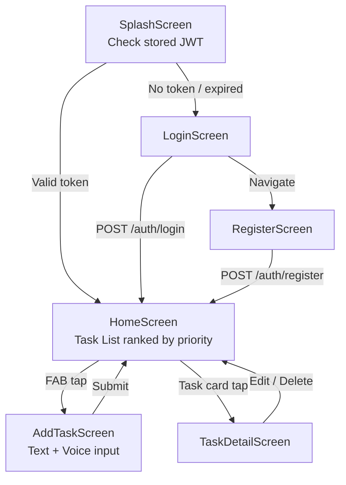

# Design Document: FocusGuard AI — Phase 1

## Overview

FocusGuard AI Phase 1 is the foundational layer of an AI-powered Android productivity app. It delivers custom JWT authentication backed by DynamoDB, text and voice task capture, AWS Bedrock Claude Nova-powered priority scoring (0–100), full task CRUD, and six Android screens built in Kotlin + Jetpack Compose. Every downstream phase depends on this layer being solid — it is not optional infrastructure, it is the entire product at this stage.

The system is a three-tier architecture: a native Android client (MVVM with Jetpack Compose), a stateless FastAPI backend (Python), and AWS-managed persistence (DynamoDB for users and tasks, Bedrock for AI inference). Authentication is fully custom — bcrypt password hashing + python-jose JWTs stored server-side in DynamoDB, no Cognito or third-party auth service. The design is deliberately minimal: no scheduling, no risk prediction, no calendar sync, no voice calls. Those are Phase 2 and 3 concerns.

---

## Architecture

### System Overview

```mermaid
graph TD
    subgraph Android["Android Client (Kotlin + Jetpack Compose)"]
        UI[Compose Screens]
        VM[ViewModels]
        REPO[Repositories]
        API_CLIENT[Retrofit ApiService]
        SR[SpeechRecognizer]
    end

    subgraph Backend["FastAPI Backend (Python)"]
        AUTH_ROUTER[/auth router]
        TASKS_ROUTER[/tasks router]
        AUTH_DEP[JWT Auth Dependency]
        BEDROCK_SVC[BedrockService]
        DYNAMO_SVC[DynamoDBService]
    end

    subgraph AWS["AWS Services"]
        DYNAMO_USERS[(focusguard_users\nDynamoDB)]
        DYNAMO_TASKS[(focusguard_tasks\nDynamoDB)]
        BEDROCK[AWS Bedrock\nClaude Nova]
    end

    UI --> VM --> REPO --> API_CLIENT
    API_CLIENT -->|HTTPS + Bearer JWT| AUTH_ROUTER
    API_CLIENT -->|HTTPS + Bearer JWT| TASKS_ROUTER
    SR -->|raw transcript| VM

    AUTH_ROUTER --> DYNAMO_SVC
    TASKS_ROUTER --> AUTH_DEP
    AUTH_DEP --> DYNAMO_SVC
    TASKS_ROUTER --> BEDROCK_SVC
    TASKS_ROUTER --> DYNAMO_SVC
    BEDROCK_SVC --> BEDROCK
    DYNAMO_SVC --> DYNAMO_USERS
    DYNAMO_SVC --> DYNAMO_TASKS
```

### Android Screen Navigation




---

## Components and Interfaces

### Backend Components

#### 1. AuthRouter (`routers/auth.py`)

**Purpose**: Handles user registration and login. The only routes that do not require a JWT.

**Interface**:
```python
@router.post("/auth/register", response_model=AuthResponse, status_code=201)
async def register(payload: RegisterRequest, db: DynamoDBService = Depends()) -> AuthResponse: ...

@router.post("/auth/login", response_model=AuthResponse)
async def login(payload: LoginRequest, db: DynamoDBService = Depends()) -> AuthResponse: ...
```

**Responsibilities**:
- Validate uniqueness of email via DynamoDB GSI query before inserting
- Hash passwords with bcrypt (rounds=12) — never store plaintext
- Generate and return signed JWT on successful register and login
- Return 409 on duplicate email, 401 on bad credentials

#### 2. TasksRouter (`routers/tasks.py`)

**Purpose**: Full CRUD for tasks plus voice transcript task creation. All routes are JWT-protected.

**Interface**:
```python
@router.post("/tasks", response_model=TaskResponse, status_code=201)
async def create_task(payload: CreateTaskRequest, current_user: User = Depends(get_current_user)) -> TaskResponse: ...

@router.post("/tasks/voice", response_model=TaskResponse, status_code=201)
async def create_task_voice(payload: VoiceTaskRequest, current_user: User = Depends(get_current_user)) -> TaskResponse: ...

@router.get("/tasks", response_model=list[TaskResponse])
async def list_tasks(current_user: User = Depends(get_current_user)) -> list[TaskResponse]: ...

@router.get("/tasks/{task_id}", response_model=TaskResponse)
async def get_task(task_id: str, current_user: User = Depends(get_current_user)) -> TaskResponse: ...

@router.put("/tasks/{task_id}", response_model=TaskResponse)
async def update_task(task_id: str, payload: UpdateTaskRequest, current_user: User = Depends(get_current_user)) -> TaskResponse: ...

@router.delete("/tasks/{task_id}", status_code=204)
async def delete_task(task_id: str, current_user: User = Depends(get_current_user)) -> None: ...
```

**Responsibilities**:
- Extract `userId` from JWT via `get_current_user` dependency on every request
- Delegate AI scoring to BedrockService for create and voice routes
- Delegate all persistence to DynamoDBService
- Return tasks sorted descending by `priorityScore` on list endpoint


#### 3. BedrockService (`services/bedrock_service.py`)

**Purpose**: Wraps AWS Bedrock Claude Nova invocation. Converts raw task text or voice transcript into a structured task payload with priority score.

**Interface**:
```python
class BedrockService:
    async def analyze_task(self, raw_input: str, current_time_iso: str, effort_hours: float | None) -> BedrockTaskResult: ...
    def _build_prompt(self, raw_input: str, current_time_iso: str, effort_hours: float | None) -> str: ...
    def _parse_response(self, raw_response: str) -> BedrockTaskResult: ...
```

**Responsibilities**:
- Build structured prompt instructing Claude Nova to extract title, deadline, effort, category, priority score, and rank reason
- Call `bedrock-runtime:InvokeModel` with `anthropic.claude-nova` model ID via `boto3`
- Parse JSON from Claude's response; raise `BedrockParseError` if response is malformed
- Never expose raw Bedrock errors to the API layer — wrap in domain exceptions

#### 4. DynamoDBService (`services/dynamodb_service.py`)

**Purpose**: All DynamoDB read/write operations. Single responsibility: persistence only, no business logic.

**Interface**:
```python
class DynamoDBService:
    async def create_user(self, user: UserRecord) -> UserRecord: ...
    async def get_user_by_email(self, email: str) -> UserRecord | None: ...
    async def get_user_by_id(self, user_id: str) -> UserRecord | None: ...
    async def create_task(self, task: TaskRecord) -> TaskRecord: ...
    async def get_tasks_by_user(self, user_id: str) -> list[TaskRecord]: ...
    async def get_task(self, user_id: str, task_id: str) -> TaskRecord | None: ...
    async def update_task(self, user_id: str, task_id: str, updates: dict) -> TaskRecord: ...
    async def delete_task(self, user_id: str, task_id: str) -> None: ...
```

**Responsibilities**:
- Use `userId` as PK and `taskId` as SK for all task operations (composite key)
- Query `email-index` GSI for user email lookups (no table scans)
- Raise `TaskNotFoundError` when get/update/delete targets a non-existent item
- Set `updatedAt` automatically on all update operations

#### 5. JWT Auth Dependency (`auth/jwt.py`)

**Purpose**: FastAPI dependency that validates Bearer JWTs on every protected route.

**Interface**:
```python
def get_current_user(token: str = Depends(oauth2_scheme), db: DynamoDBService = Depends()) -> User: ...
def create_access_token(data: dict) -> str: ...
def verify_token(token: str) -> dict: ...
```

**Responsibilities**:
- Decode and verify JWT signature using `JWT_SECRET` env var and HS256 algorithm
- Check token expiry (`exp` claim)
- Raise `HTTP 401` with `WWW-Authenticate: Bearer` header on any validation failure
- Return `User` domain object (not the raw DynamoDB record) to route handlers


### Android Components

#### 6. ApiService (`data/api/ApiService.kt`)

**Purpose**: Retrofit interface defining all HTTP calls to the FastAPI backend.

**Interface**:
```kotlin
interface ApiService {
    @POST("auth/register")
    suspend fun register(@Body request: RegisterRequest): AuthResponse

    @POST("auth/login")
    suspend fun login(@Body request: LoginRequest): AuthResponse

    @POST("tasks")
    suspend fun createTask(@Header("Authorization") token: String, @Body request: CreateTaskRequest): TaskResponse

    @POST("tasks/voice")
    suspend fun createVoiceTask(@Header("Authorization") token: String, @Body request: VoiceTaskRequest): TaskResponse

    @GET("tasks")
    suspend fun getTasks(@Header("Authorization") token: String): List<TaskResponse>

    @GET("tasks/{id}")
    suspend fun getTask(@Header("Authorization") token: String, @Path("id") taskId: String): TaskResponse

    @PUT("tasks/{id}")
    suspend fun updateTask(@Header("Authorization") token: String, @Path("id") taskId: String, @Body request: UpdateTaskRequest): TaskResponse

    @DELETE("tasks/{id}")
    suspend fun deleteTask(@Header("Authorization") token: String, @Path("id") taskId: String)
}
```

#### 7. TaskRepository (`data/repository/TaskRepository.kt`)

**Purpose**: Single source of truth for task data. Abstracts the Retrofit API from ViewModels.

**Interface**:
```kotlin
class TaskRepository(private val api: ApiService, private val tokenManager: TokenManager) {
    suspend fun createTask(request: CreateTaskRequest): Result<TaskResponse>
    suspend fun createVoiceTask(transcript: String): Result<TaskResponse>
    suspend fun getTasks(): Result<List<TaskResponse>>
    suspend fun getTask(taskId: String): Result<TaskResponse>
    suspend fun updateTask(taskId: String, request: UpdateTaskRequest): Result<TaskResponse>
    suspend fun deleteTask(taskId: String): Result<Unit>
}
```

**Responsibilities**:
- Prepend `"Bearer "` to all token headers automatically
- Wrap all API calls in `try/catch`, return `Result.success` or `Result.failure`
- Map `HttpException(401)` to a `TokenExpiredException` for ViewModels to handle uniformly

#### 8. ViewModels

**HomeViewModel** (`ui/home/HomeViewModel.kt`):
```kotlin
class HomeViewModel(private val repo: TaskRepository) : ViewModel() {
    val tasks: StateFlow<List<TaskResponse>>
    val uiState: StateFlow<HomeUiState>  // Loading | Success | Error

    fun loadTasks()
    fun deleteTask(taskId: String)
    fun updateTaskStatus(taskId: String, status: String)
}
```

**AddTaskViewModel** (`ui/addtask/AddTaskViewModel.kt`):
```kotlin
class AddTaskViewModel(private val repo: TaskRepository) : ViewModel() {
    val uiState: StateFlow<AddTaskUiState>  // Idle | Submitting | Success | Error

    fun submitTextTask(request: CreateTaskRequest)
    fun submitVoiceTask(transcript: String)
    fun onSpeechResult(result: String)  // called from SpeechRecognizer callback
}
```

**AuthViewModel** (`ui/auth/AuthViewModel.kt`):
```kotlin
class AuthViewModel(private val authRepo: AuthRepository, private val tokenManager: TokenManager) : ViewModel() {
    val uiState: StateFlow<AuthUiState>  // Idle | Loading | Success | Error

    fun login(email: String, password: String)
    fun register(email: String, password: String, name: String)
}
```

